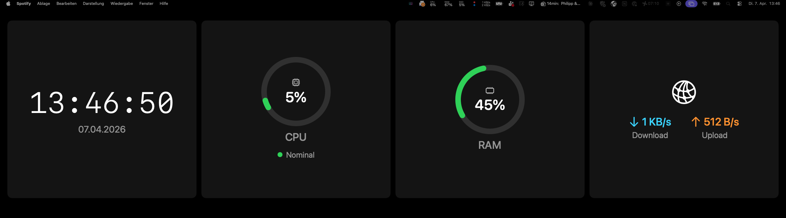

# SystemPulse

A minimal macOS menu bar app that renders a live system stats dashboard on the **Corsair Xeneon Edge** touch display, treating it as a standard secondary monitor.



## Features

- **Clock** — time and date, updated every second
- **CPU** — usage percentage with colour-coded arc gauge + thermal pressure indicator
- **RAM** — memory usage with colour-coded arc gauge
- **Network** — live download and upload speeds

All widgets render natively at full resolution — no blurry scaled bitmaps.

## How it works

macOS recognises the Xeneon Edge as a standard external display over USB-C. SystemPulse opens a borderless, non-activating window that fills the display exactly. No proprietary SDK, no HID protocol, no iCUE required.

## Requirements

- macOS 13 Ventura or later
- Apple Silicon Mac (arm64)
- Xcode Command Line Tools (`xcode-select --install`)
- Corsair Xeneon Edge connected via USB-C

> **Note:** Full Xcode.app is not required — the project builds entirely with Swift Package Manager and the command line tools.

## Install

### 1. Clone the repo

```bash
git clone https://github.com/yourusername/SystemPulse.git
cd SystemPulse
```

### 2. Build

```bash
bash build.sh
```

This compiles the app, assembles the `.app` bundle, and clears the Gatekeeper quarantine flag automatically.

### 3. Run

```bash
open XeneonWidgets.app
```

A **SystemPulse icon** appears in your menu bar. Connect your Xeneon Edge and the dashboard opens on it automatically.

### 4. Launch at login (optional)

Open **System Settings → General → Login Items** and add `XeneonWidgets.app`.

## Usage

Click the menu bar icon to access:

| Action | Result |
|---|---|
| **Hide / Show Dashboard** | Toggles the widget window on/off |
| **Xeneon Edge: Connected/Not Connected** | Live connection status |
| **Quit SystemPulse** | Exits the app |

The dashboard reopens automatically when the Xeneon Edge is reconnected.

## Project structure

```
Sources/XeneonWidgets/
├── App/
│   └── AppDelegate.swift       # Menu bar, screen lifecycle
├── Display/
│   ├── DisplayManager.swift    # Detects the Xeneon Edge via NSScreen
│   └── WidgetWindow.swift      # Borderless NSPanel on the target display
├── Widgets/
│   ├── ArcGauge.swift          # Crisp native arc gauge component
│   ├── WidgetContainer.swift   # 4-column grid layout
│   ├── ClockWidget.swift
│   ├── CPUWidget.swift
│   ├── RAMWidget.swift
│   └── NetworkWidget.swift
└── Data/
    └── SystemStatsProvider.swift  # IOKit/sysctl polling
```

## Technical notes

- **No App Sandbox** — `host_processor_info`, `vm_statistics64`, and `getifaddrs` are all blocked by the sandbox; this app does not need to be on the Mac App Store
- **CPU temperature** — Apple Silicon locks SMC reads behind a private entitlement (`com.apple.private.smckit`). The CPU widget shows **thermal pressure state** (Nominal / Fair / Serious / Critical) via `NSProcessInfo.thermalState`, which is the same signal the OS uses to trigger throttling
- **Display detection** — matches by display name (`"XENEON EDGE"`) first, then by resolution (`2560×720` or `1280×800`) as a fallback

## License

MIT
